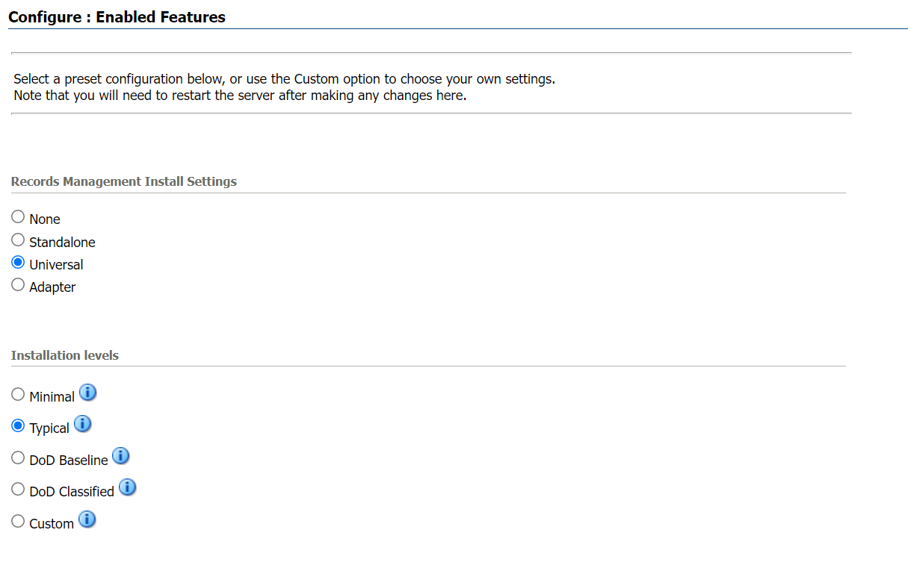
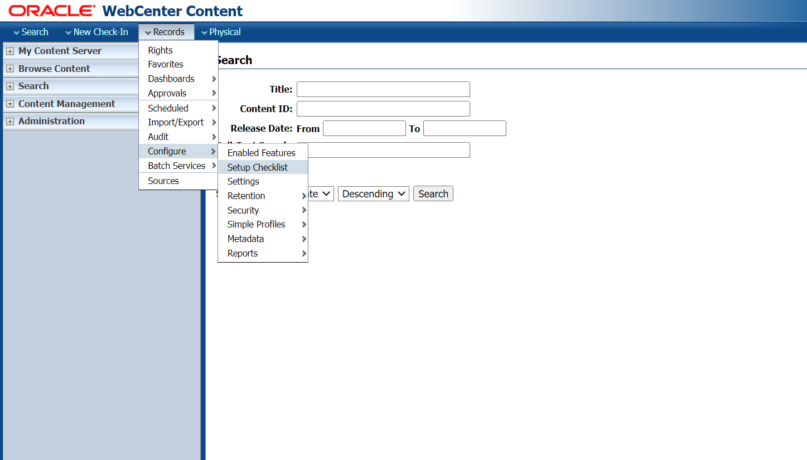
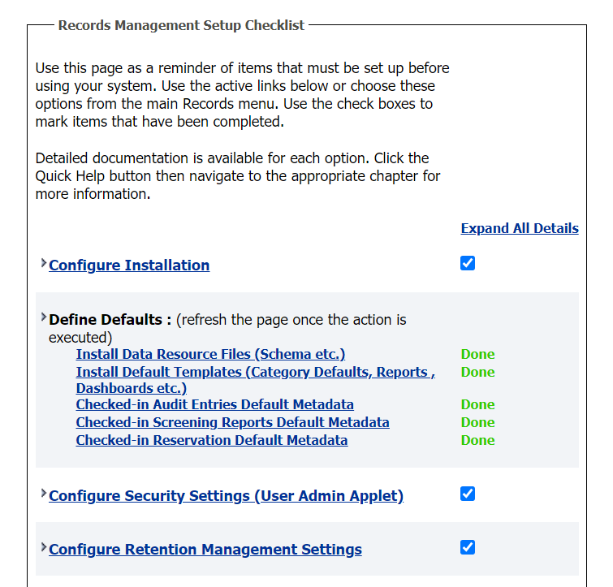

# Introduction
In this lab,you will learn about Records Management system in WebCenter Content and how it is useful in retaining and disposing the content as and when required by the Organization.

## About this Workshop

In this workshop, you will understand the different types of disposition rules that can be applied on 3 different record folders shown in the diagram below.An Organization has legal documents that need to be categorized and stored in separate folders.Depending on its usage,records needs to be purged from the system that are no longer required. WebCenter Content Records Management provides various predefined events , retention periods and actions that can used according to the requirement.
    

There are 3 record folders each having legal records such as MOU's , Non-disclosure Agreement & Software Development Agreement all created under Retention Category named Legal Documents.For the MOU Record Folder ,event based disposition rule acts on the MOU records based on the occurrence of an event. After which the record gets closed or cut off and goes through the approval process before getting purged from the system .For the Non-disclosure Agreement Record Folder , time based disposition rule acts on the Agreements based on the certain time period the user has defined, followed by which the agreement gets archived or removed from the system. For the Software Agreement record folder,event-time based disposition rule acts on the Software Agreement based on both the occurrence of an event and at the certain time period defined by the user .Finally after the records in each specific records folder have met the condition and retained for certain time period,they are then purged from the system after the approval from the authorized user based on the configuration.

Estimated Time: 30 minutes

### Objectives

In this workshop, you will:
* Start WebLogic and WebCenter Content Server
* Selecting the Installation option for Records
* Configure Setup Checklist

## Task 1: Start WebLogic and WebCenter Content Server

Before getting started, you should start the WebLogic server and content server.

1.  Login to the demo environment. Navigate to the following directory shown below and run the command startWebLogic.cmd .
       ```
    <copy>C:\Oracle\Middleware\Oracle_Home\user_projects\domains\base_domain\bin</copy>
    ```

2.  Once the WebLogic is running,start the content server using the same location mentioned above and start UCM server    with the command startManagedWebLogic.cmd UCM_server1 to start the WebCenter Content Server.
    > **Note:** Make sure to login to the database and check if the pluggable database PDBORCL is in read/write mode before starting the servers.

3. Open any browser and type the following URL to access the WebCenter Content Server.
   http://localhost:16200/cs/


## Task 2: Install Records on UCM and configure the Setup Checklist.


1. Login to Content server as an administrator and click on **Configure Records Settings** under Administration tab as shown in the image below.
    

2.  Select the software configuration as shown in the image.
      
      

    > **Note:** Restart the servers after selecting the installation settings for the changes to be applied.


3. After the installation is successfully completed ,configure the setup checklist by clicking on **Records** tab,select **Configure** option and then select **Setup Checklist**.
     

4. On the Setup Checklist page install the defaults and configure security settings.
     


You may now [proceed to the next lab](#next).

## Want to Learn More?

* [Introduction To WebCenter Records](https://docs.oracle.com/en/middleware/webcenter/content/12.2.1.4/index.html)


## Acknowledgements

* **Authors:**
    * Shriraksha S Nataraj, Staff Solution Engineer , Oracle WebCenter Content
* **Contributors:**
    * Shriraksha S Nataraj, Staff Solution Engineer , Oracle WebCenter Content
* **Last Updated By/Date:** Shriraksha S Nataraj , May 2022
